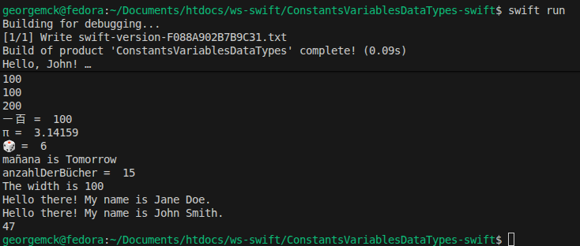

# ConstantsVariablesDataTypes-swift

#create an app  
swift build

#run the app  
swift run

[https://github.com/PixelPalsPCC/SwiftFundamentalsLabs](https://github.com/PixelPalsPCC/SwiftFundamentalsLabs)

Apple Book [Develop in Swift Fundamentals](https://books.apple.com/us/book/develop-in-swift-fundamentals/id6468967906) Xcode 15

